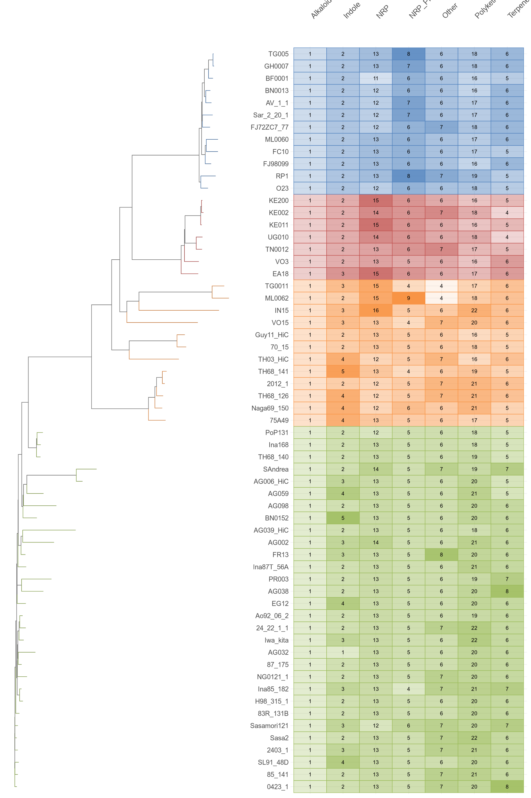
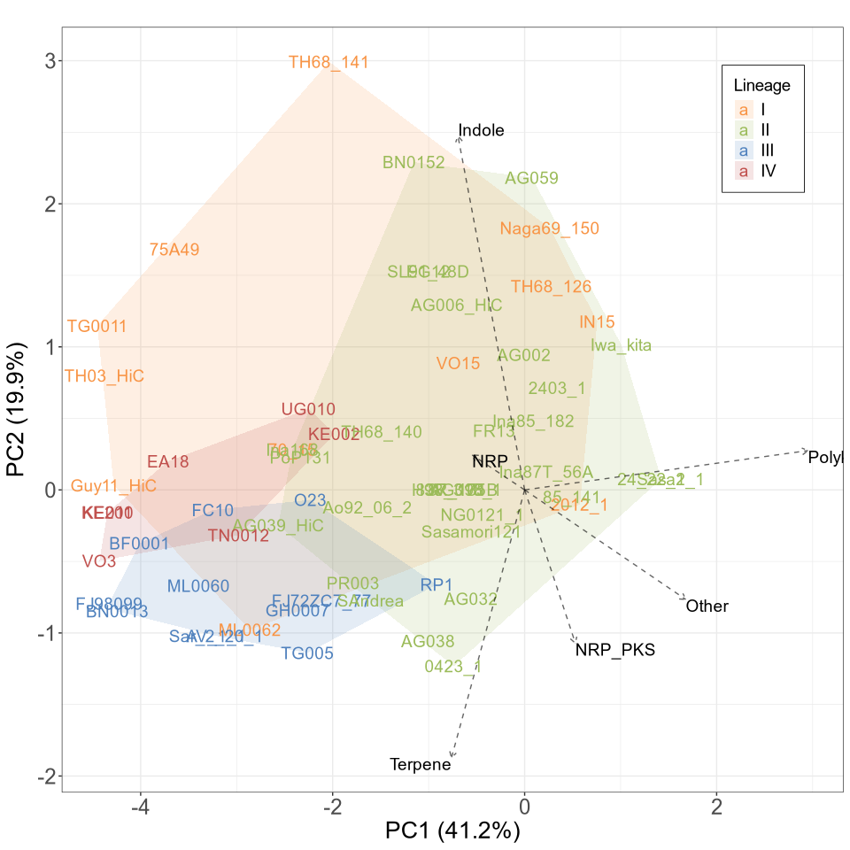
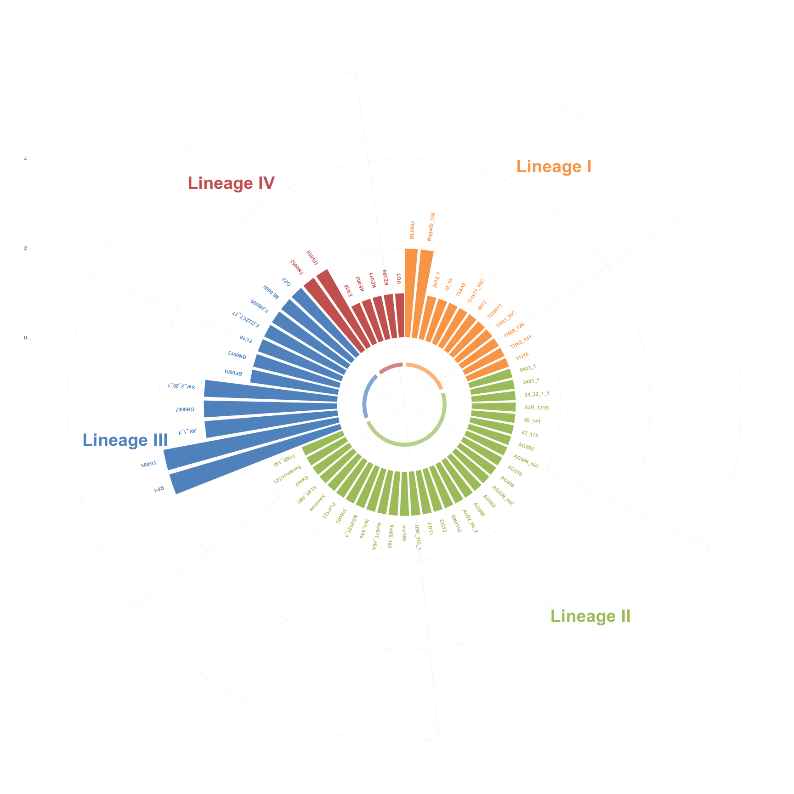
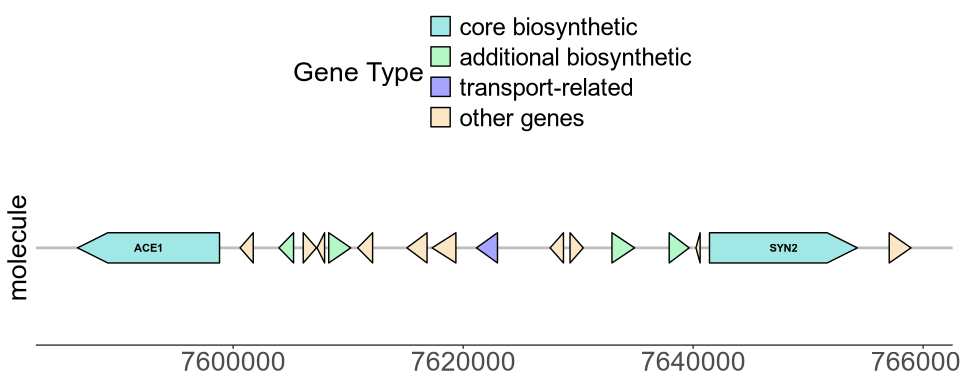
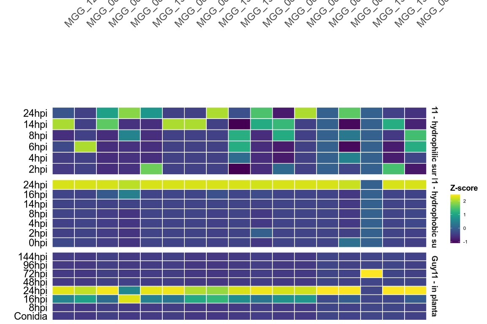
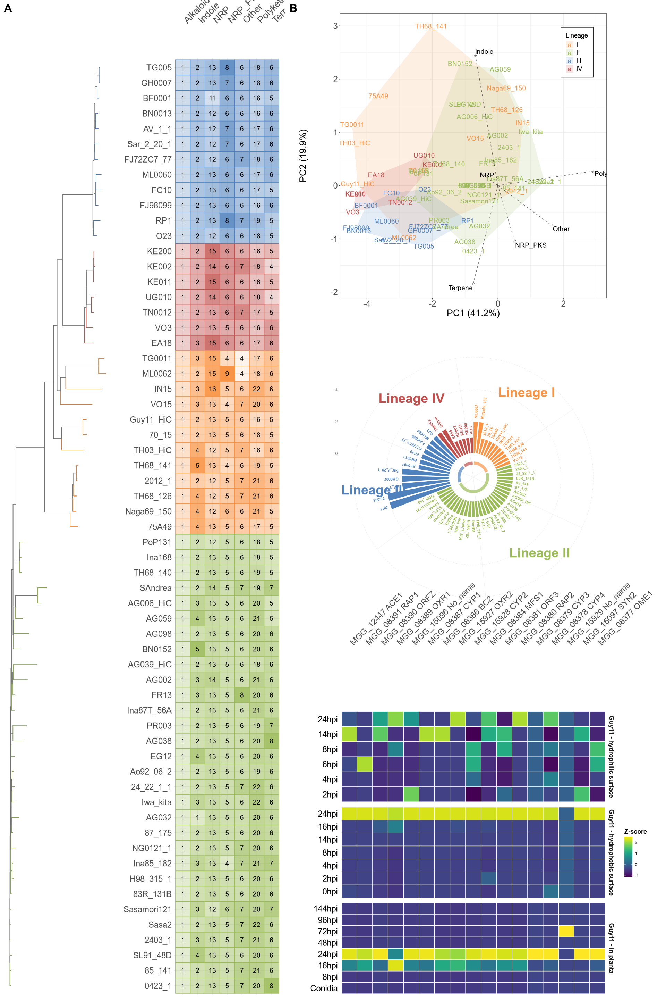

BGCs in M. oryzae Pangenome Analysis
================
Neha Sahu
Last modified: 10 December, 2025

- [Introduction](#introduction)
- [Processing antiSMASH output
  files](#processing-antismash-output-files)
  - [Load Libraries](#load-libraries)
  - [Load Data](#load-data)
- [Process antiSMASH Data](#process-antismash-data)
- [BGCs Copy Number Analyses](#bgcs-copy-number-analyses)
  - [Create BGC Copy Number Matrix](#create-bgc-copy-number-matrix)
  - [Copy Number Heatmap](#copy-number-heatmap)
  - [Phylogenetic PCA](#phylogenetic-pca)
  - [PCA Biplot](#pca-biplot)
  - [Boxplot showing Most similar known
    clusters](#boxplot-showing-most-similar-known-clusters)
  - [ACE1 Gene Cluster Copy Numbers](#ace1-gene-cluster-copy-numbers)
  - [Genes in the ACE1 Cluster](#genes-in-the-ace1-cluster)
  - [ACE1 Gene Expression Analysis](#ace1-gene-expression-analysis)
- [Combined Main Figure](#combined-main-figure)
  - [**Figure: Biosynthetic Gene Clusters Across *Magnaporthe oryzae*
    Pangenome.**](#figure-biosynthetic-gene-clusters-across-magnaporthe-oryzae-pangenome)
- [Session Info](#session-info)

# Introduction

This document compiles analysis on antiSMASH results for identification
of biosynthetic gene clusters (BGCs) across 61 *Magnaporthe oryzae*
pangenome isolates.

> The main goal here is to characterize BGC distribution patterns across
> the 61 isolates and identify lineage-specific differences (if any) in
> BGC copy number and composition among the four lineages.

- Genome assemblies were collected from **Joe’s** collection on OneDrive
  from the `"Assemblies"` folder.

- AntiSMASH (*version 7.0.0*) was run on HPC using the script provided
  at `scripts/002_antismash.sh`.

  > The analysis pipeline was developed and executed on the Norwich
  > BioScience Institute’s HPC cluster, using SLURM workload manager.
  > This means that the provided bash scripts (`.sh` files) have
  > platform-specific resource allocations that require adjustment for
  > other computing environments.

- Genome assemblies (FASTA format) were organized in the `input/`
  directory within the project’s scratch space, and results were placed
  in `output/` directory with isolate-specific subdirectories.

- From antiSMASH’s output suite, the `index.html` files were used
  extract and tabulate BGC annotations including summaries of all
  identified clusters with their genomic coordinates, cluster types and
  similarity to know BGCs.

# Processing antiSMASH output files

## Load Libraries

``` r
library(tidyverse)
library(phytools)
library(ggtree)
library(patchwork)
library(rvest)
library(viridis)
library(scales)
library(gggenes)
library(ggrepel)
library(ggpubr)
library(ggh4x)
```

## Load Data

- Got the Lineage information for 61 isolates from **Yu’s** excel sheet
  on OneDrive - which I copied and saved at `data/raw/lineage_info.tsv`

- Got the species tree from **Sergio -** saved at
  `data/raw/core_orthologues_in_Guy11.pangenome.treefile`

``` r
# Lineage information
lineage_info<-read_tsv(here("data/raw/lineage_info.tsv"))

# Hex codes provided by Sergio
lineage_colors<-c("I"='#f89445ff', "II"='#9bbb59ff', "III"='#4f81bd', "IV"='#c0504d')

# Pangenome species tree
tree<-read.tree(here("data/raw/core_orthologues_in_Guy11.pangenome.treefile")) 
tree<-ladderize(tree, right=FALSE)
tree$tip.label<-gsub("-", "_", tree$tip.label)

# Extract phylogenetic order to arrange the order of species later
species_order<-tree$tip.label[tree$edge[tree$edge[,2] <= length(tree$tip.label), 2]]

# Plot tree
tree_plot_data<-tibble(species=tree$tip.label) %>%
  left_join(lineage_info, by="species")
  
tree_plot<-ggtree(tree) %<+%
  tree_plot_data +
  geom_tree(aes(color=clade)) + 
  geom_tiplab(aes(color=clade), size=0) +
  scale_color_manual(values=lineage_colors, name="Lineage") +
  theme(legend.position="none")
tree_plot
```


# Process antiSMASH Data

Among the various output files generated by antiSMASH, I used the
`index.html` file for each isolate. This file provides a summary of all
identified biosynthetic gene clusters (BGCs) for each chromosome/contig,
including their genomic locations, type of BGCs, similarity to known
clusters, and additional cluster annotations into a single table. The
complete antiSMASH output files are available in
`data/intermediate/antismash_output/`.

``` r
# Function to extract data from antiSMASH index.html files with contig information
process_antismash_html<-function(html_path, species) {
  html_content<-read_html(html_path)
  # Get all contig names
  contig_headers<-html_content %>% 
    html_nodes("div.record-overview-header strong") %>%
    html_text(trim=TRUE)
  # Get all data rows 
  data_rows<-html_content %>% html_nodes("tr.linked-row")
  if (length(data_rows) == 0) {
    warning(paste("No data rows found in", species))
    return(NULL)
  }
  # Get all tables to match rows and contigs - these would be the BGC regions
  tables<-html_content %>% html_nodes("table.region-table")
  # Create a mapping from row to contig
  row_to_contig<-character(length(data_rows))
  current_row_idx<-1
  for (i in seq_along(tables)) {
    table_rows<-tables[[i]] %>% html_nodes("tr.linked-row")
    n_rows<-length(table_rows)
    if (n_rows > 0 && i <= length(contig_headers)) {
      row_to_contig[current_row_idx:(current_row_idx + n_rows - 1)]<-contig_headers[i]
      current_row_idx<-current_row_idx + n_rows
    }
  }
  # Process rows with contig information
  map_dfr(seq_along(data_rows), function(i) {
    row<-data_rows[[i]]
    cells<-row %>% html_nodes("td")
    region<-cells[1] %>% html_text(trim=TRUE)
    type<-cells[2] %>% html_text(trim=TRUE)
    from<-cells[3] %>% html_text(trim=TRUE)
    to<-cells[4] %>% html_text(trim=TRUE)
    if (length(cells) >= 7) {
      most_similar<-cells[5] %>% html_text(trim=TRUE)
      product_type<-cells[6] %>% html_text(trim=TRUE)
      similarity<-cells[7] %>% html_text(trim=TRUE)
    } else {
      most_similar<-NA_character_
      product_type<-NA_character_
      similarity<-NA_character_
    }
    tibble(
      Isolate=species,
      Chromosome=row_to_contig[i],
      Region=region,
      Type=type,
      Start=from,
      End=to,
      `Most similar known cluster`=most_similar,
      `Product Type`=product_type,
      Similarity=similarity
    )
  })
}


# Find and process all index.html files from their individual subfolders
base_path<-here("data/interim/antismash_output")
index_files<-list.files(path=base_path, pattern="index\\.html$",
                         recursive=TRUE, full.names=TRUE)
speciess<-dirname(index_files) %>% basename()

all_antismash_data<-map2_dfr(index_files, speciess, ~{
  cat("Processing:", .y, "\n")
  tryCatch(process_antismash_html(.x, .y),
           error=function(e) {
             warning(paste("Error processing", .y, ":", e$message))
             return(NULL)
           })
}) %>% distinct()
```

    ## Processing: 0423_1 
    ## Processing: 2012_1 
    ## Processing: 24_22_1_1 
    ## Processing: 2403_1 
    ## Processing: 70_15 
    ## Processing: 75A49 
    ## Processing: 83R_131B 
    ## Processing: 85_141 
    ## Processing: 87_175 
    ## Processing: AG002 
    ## Processing: AG006_HiC 
    ## Processing: AG032 
    ## Processing: AG038 
    ## Processing: AG039_HiC 
    ## Processing: AG059 
    ## Processing: AG098 
    ## Processing: Ao92_06_2 
    ## Processing: AV_1_1 
    ## Processing: BF0001 
    ## Processing: BN0013 
    ## Processing: BN0152 
    ## Processing: EA18 
    ## Processing: EG12 
    ## Processing: FC10 
    ## Processing: FJ72ZC7_77 
    ## Processing: FJ98099 
    ## Processing: FR13 
    ## Processing: GH0007 
    ## Processing: Guy11_HiC 
    ## Processing: H98_315_1 
    ## Processing: IN15 
    ## Processing: Ina168 
    ## Processing: Ina85_182 
    ## Processing: Ina87T_56A 
    ## Processing: Iwa_kita 
    ## Processing: KE002 
    ## Processing: KE011 
    ## Processing: KE200 
    ## Processing: ML0060 
    ## Processing: ML0062 
    ## Processing: Naga69_150 
    ## Processing: NG0121_1 
    ## Processing: O23 
    ## Processing: PoP131 
    ## Processing: PR003 
    ## Processing: RP1 
    ## Processing: SAndrea 
    ## Processing: Sar_2_20_1 
    ## Processing: Sasa2 
    ## Processing: Sasamori121 
    ## Processing: SL91_48D 
    ## Processing: TG0011 
    ## Processing: TG005 
    ## Processing: TH03_HiC 
    ## Processing: TH68_126 
    ## Processing: TH68_140 
    ## Processing: TH68_141 
    ## Processing: TN0012 
    ## Processing: UG010 
    ## Processing: VO15 
    ## Processing: VO3

``` r
# Clean data
all_antismash_clean<-all_antismash_data %>%
  mutate(
    Chromosome=gsub("-","_",Chromosome),
    Region=str_extract(Region, "\\d+\\.\\d+"),
    Start=as.numeric(str_remove_all(Start, ",")),
    End=as.numeric(str_remove_all(End, ",")),
    Similarity=if_else(!is.na(Similarity) & Similarity != "",
                        as.numeric(str_remove(Similarity, "%")), NA_real_),
    Isolate=str_replace_all(Isolate, "-", "_"),
    Type_broad=map_chr(Type, function(type_string) {
      types<-str_split(type_string, ",")[[1]]
      types<-str_trim(types)
      types<-sort(types)
      paste(types, collapse=",")
    }),
    `Most similar known cluster`=replace_na(`Most similar known cluster`, "no_known_similarity"),
    Type=if_else(is.na(`Product Type`), Type_broad, `Product Type`)
  ) %>%
  select(-`Product Type`) %>%
  filter(Chromosome!="") %>%
  mutate(Type=case_when(
    Type %in% c("NRP+Polyketide", "Polyketide+NRP") ~ "NRP_PKS",
    str_detect(Type, "^NRP\\+Polyketide:") ~ "NRP_PKS",
    str_detect(Type, "^Polyketide:") ~ "Polyketide",
    str_detect(Type, "T1PKS|T3PKS|Polyketide") & str_detect(Type, "NRPS|NRP") ~ "NRP_PKS",
    str_detect(Type, "T1PKS|T3PKS|Polyketide") ~ "Polyketide",
    str_detect(Type, "NRPS|NRP") ~ "NRP",
    str_detect(Type, "terpene|Terpene") ~ "Terpene",
    str_detect(Type, "indole") ~ "Indole",
    Type == "Alkaloid" ~ "Alkaloid",
    Type == "arylpolyene,fungal-RiPP-like" ~ "Other",
    Type == "fungal-RiPP-like" ~ "Other",
    TRUE ~ Type
  )) %>%
  rename(Type_borad=Type,
         Type=Type_broad,
         ) %>%
  select(Isolate,
         Chromosome,
         Region,
         Start,
         End,
         `Most similar known cluster`,
         Similarity,
         Type,
         Type_borad) %>%
  rename(Type_broad=Type_borad)

contig_summary<-all_antismash_clean %>%
  group_by(Isolate) %>%
  summarise(
    n_contigs=n_distinct(Chromosome),
    n_regions=n(),
    contig_names=paste(unique(Chromosome), collapse=", "),
    .groups="drop"
  )
contig_summary
```

    ## # A tibble: 61 × 4
    ##    Isolate   n_contigs n_regions contig_names                                   
    ##    <chr>         <int>     <int> <chr>                                          
    ##  1 0423_1           12        56 0423_1_cont_00, 0423_1_cont_01, 0423_1_cont_02…
    ##  2 2012_1           19        54 2012_1_cont_00, 2012_1_cont_01, 2012_1_cont_02…
    ##  3 2403_1           10        56 2403_1_cont_00, 2403_1_cont_01, 2403_1_cont_02…
    ##  4 24_22_1_1        11        56 24_22_1_1_cont_00, 24_22_1_1_cont_01, 24_22_1_…
    ##  5 70_15             8        50 1, 2, 3, 4, 5, 6, 7, supercont8.8              
    ##  6 75A49            10        51 75A49_chr1_con2, 75A49_chr1_con6, 75A49_chr2_c…
    ##  7 83R_131B          9        53 83R_131B_cont00, 83R_131B_cont01, 83R_131B_con…
    ##  8 85_141            8        55 85_141_cont_00, 85_141_cont_01, 85_141_cont_02…
    ##  9 87_175           11        53 87_175_cont_00, 87_175_cont_01, 87_175_cont_02…
    ## 10 AG002            15        56 AG002_chr1_con4, AG002_chr1_con5, AG002_chr1_c…
    ## # ℹ 51 more rows

``` r
save_data(all_antismash_clean,"all_antismash_clean",format="tsv")
save_data(contig_summary, "contig_BGC_summary",format="tsv")
```

# BGCs Copy Number Analyses

## Create BGC Copy Number Matrix

This would allow us to see if BGC copy numbers have any lineage specific
signatures

``` r
# Create copy number matrix
bgc_matrix<-all_antismash_clean %>%
  filter(Isolate %in% lineage_info$species) %>%
  count(Isolate, Type_broad, name="copy_number") %>%
  pivot_wider(names_from=Type_broad, values_from=copy_number, values_fill=0) %>%
  column_to_rownames("Isolate")

#  Check if all species present
all_species<-lineage_info$species
missing_species<-setdiff(all_species, rownames(bgc_matrix))
missing_species
```

    ## character(0)

## Copy Number Heatmap

``` r
# Prepare heatmap data with copy numbers and scale by column
heatmap_data<-all_antismash_clean %>%
  count(Isolate, Type_broad, name="copy_number") %>%
  # Complete the data to include all species for all types (fill with 0)
  complete(Isolate=unique(Isolate), 
           Type_broad=unique(Type_broad), 
           fill=list(copy_number=0)) %>%
  group_by(Type_broad) %>%
  mutate(scaled_copy=scale(copy_number)[,1]) %>%
  ungroup() %>%
    # Normalize scaled_copy to 0-1 range for alpha
    mutate(alpha_value=(scaled_copy - min(scaled_copy, na.rm=TRUE)) / 
                  (max(scaled_copy, na.rm=TRUE) - min(scaled_copy, na.rm=TRUE)),
    alpha_value=if_else(is.na(alpha_value), 0.2, alpha_value)
  ) %>%
  left_join(lineage_info, by=c("Isolate"="species")) %>%
  mutate(Isolate=factor(Isolate, levels=rev(species_order)))

# Create heatmap
heatmap_plot<-ggplot(heatmap_data, 
                       aes(x=Type_broad, y=fct_rev(Isolate))) +
  geom_tile(aes(fill=clade, alpha=alpha_value,color=clade), linewidth=0.5) +
  geom_text(aes(label=copy_number),size=5) +
  scale_fill_manual(values=lineage_colors, name="Lineage") +
  scale_color_manual(values=lineage_colors, name="Lineage") +
  scale_alpha_continuous(range=c(0.1,1), name="Scaled\nCopy Number") +
  labs(title="",
       x="",
       y="") +
  scale_x_discrete(position="top") +
  theme_minimal() +
  theme(
    axis.text.x.top=element_text(angle=45, hjust=0, size=20),
    axis.text.y=element_text(size=18),
    legend.position="none",
    plot.title=element_text(face="bold")
  )


copy_num_plot<-ggarrange(tree_plot + heatmap_plot)
copy_num_plot
```



## Phylogenetic PCA

This would show us types of biosynthetic gene clusters that are most
important for distinguishing between different lineages in the analysis

``` r
# Match species between tree and matrix
common_species<-intersect(intersect(rownames(bgc_matrix), tree$tip.label), lineage_info$species)
common_species #should be 61
```

    ##  [1] "0423_1"      "2012_1"      "2403_1"      "24_22_1_1"   "70_15"      
    ##  [6] "75A49"       "83R_131B"    "85_141"      "87_175"      "AG002"      
    ## [11] "AG006_HiC"   "AG032"       "AG038"       "AG039_HiC"   "AG059"      
    ## [16] "AG098"       "AV_1_1"      "Ao92_06_2"   "BF0001"      "BN0013"     
    ## [21] "BN0152"      "EA18"        "EG12"        "FC10"        "FJ72ZC7_77" 
    ## [26] "FJ98099"     "FR13"        "GH0007"      "Guy11_HiC"   "H98_315_1"  
    ## [31] "IN15"        "Ina168"      "Ina85_182"   "Ina87T_56A"  "Iwa_kita"   
    ## [36] "KE002"       "KE011"       "KE200"       "ML0060"      "ML0062"     
    ## [41] "NG0121_1"    "Naga69_150"  "O23"         "PR003"       "PoP131"     
    ## [46] "RP1"         "SAndrea"     "SL91_48D"    "Sar_2_20_1"  "Sasa2"      
    ## [51] "Sasamori121" "TG0011"      "TG005"       "TH03_HiC"    "TH68_126"   
    ## [56] "TH68_140"    "TH68_141"    "TN0012"      "UG010"       "VO15"       
    ## [61] "VO3"

``` r
pruned_tree<-keep.tip(tree, common_species)
bgc_matched<-bgc_matrix[common_species, ]
metadata_matched<-lineage_info[match(common_species, lineage_info$species), ]

# Remove columns with zero-variance
bgc_matched<-bgc_matched[, apply(bgc_matched, 2, var) > 0, drop=FALSE]

# Run phylogenetic PCA from phytools package
phylo_pca<-phyl.pca(pruned_tree, bgc_matched, method="BM", mode="cov")

# Extract PCs
phylo_pcs<-as.data.frame(phylo_pca$S[, 1:2])
colnames(phylo_pcs)<-c("PC1", "PC2")
phylo_pcs$species<-rownames(phylo_pcs)

# Calculate variance explained
pc_variance<-diag(phylo_pca$Eval)[1:2]/sum(phylo_pca$Eval) * 100

# Get loadings
loadings<-phylo_pca$L[, 1:2]
loadings_df<-as.data.frame(loadings)
colnames(loadings_df)<-c("PC1", "PC2")
loadings_df$BGC_Type<-rownames(loadings_df)

# Merge with metadata
plot_data<-metadata_matched %>%
  mutate(species=common_species) %>%
  left_join(phylo_pcs, by="species")
```

## PCA Biplot

``` r
# Create hull data
hull_data<-plot_data %>%
  group_by(clade) %>%
  slice(chull(PC1, PC2)) %>%
  ungroup()

# Scale loadings for better visualization
loading_scale<-3
loadings_df_scaled<-loadings_df %>%
  mutate(PC1=PC1 * loading_scale,
         PC2=PC2 * loading_scale)

# Create biplot
biplot<-ggplot() +
  # Hulls
  geom_polygon(data=hull_data, aes(x=PC1, y=PC2, fill=clade), 
               alpha=0.15, color=NA) +
  # Species points
  geom_text(data=plot_data, aes(x=PC1, y=PC2, color=clade, label=species), 
             size=5, alpha=1) +
  # Loading arrows
  geom_segment(data=loadings_df_scaled,
               aes(x=0, y=0, xend=PC1, yend=PC2),
               arrow=arrow(length=unit(0.2, "cm")),
               color="black", linewidth=0.5, alpha=0.6, linetype=2) +
  # Loading labels
  geom_text(data=loadings_df_scaled,
            aes(x=PC1, y=PC2, label=BGC_Type),
            size=5, hjust="outward", vjust="outward") +
  scale_color_manual(values=lineage_colors, name="Lineage") +
  scale_fill_manual(values=lineage_colors, name="Lineage") +
  labs(title="",
       x=paste0("PC1 (", round(pc_variance[1], 1), "%)"),
       y=paste0("PC2 (", round(pc_variance[2], 1), "%)")) +
  theme_bw() +
  theme(legend.position=c(0.95, 0.95),  # x, y coordinates (0-1 scale)
    legend.justification=c("right", "top"),  # Anchor point for color key
    legend.box.just="right",
    legend.text=element_text(size=14),
    legend.title=element_text(size=14),
    legend.background=element_rect(fill="white", color="black", linewidth=0.3),
    legend.margin=margin(10, 10, 10, 10),
        axis.title=element_text(size=20),
    axis.text=element_text(size=18))


biplot
```



## Boxplot showing Most similar known clusters

``` r
known_similarity<-data.frame(table(all_antismash_clean$Type_broad,
                                   all_antismash_clean$`Most similar known cluster`,
                                   all_antismash_clean$Isolate)) %>%
                               filter(Freq!=0)  %>%
  rename(Type_broad=Var1,
         Known_BGC=Var2,
         Isolate=Var3) %>%
  left_join(lineage_info,by=c("Isolate"="species")) %>%
  mutate(Known_BGC=word(Known_BGC,1,1,sep=" "),
         Known_BGC=gsub("fusaridione","fusarin",Known_BGC)) # Abbreviated for better visualization

  

boxplot_known_BGCs<-ggplot(data=known_similarity, aes(x=Known_BGC,y=Freq, fill=clade)) +
  # boxplot
  geom_boxplot(aes(x=Known_BGC,y=Freq, color=clade,alpha=0.5)) +
  scale_color_manual(values=lineage_colors, name="Lineage") +
  scale_fill_manual(values=lineage_colors, name="Lineage") +
  theme_bw() +
  facet_wrap(~Type_broad,scales="free") +
  theme(legend.position="bottom",
        panel.grid.minor=element_blank(),
        plot.title=element_text(face="bold"),
        axis.text.x=element_text(angle=45,hjust=1,size=16),
        axis.text.y=element_text(size=16),
        strip.background=element_blank(),
        strip.text= element_text(size=16,face="bold"))
boxplot_known_BGCs
```


From the above plot, ACE1 looks interesting, as it has more copies in
III (blue) and (II) red lineage as compared to the other two

## ACE1 Gene Cluster Copy Numbers

``` r
# Plot ACE1 data
ace1_data<-all_antismash_clean %>%
  filter(`Most similar known cluster` == "ACE1") %>%
  count(Isolate, name="BGC_specific_count") %>%
  left_join(lineage_info, by=c("Isolate"="species")) %>%
  arrange(clade, desc(BGC_specific_count)) %>%
  mutate(
    id=row_number(),
    angle=90 - 360 * (id - 0.5) / n(),
    hjust=ifelse(angle > 90 & angle < 270, 1, 0),
    angle_text=ifelse(angle > 90 & angle < 270, angle + 180, angle)
  )


# Create circular barplot
ace1_circular<-ggplot(ace1_data, aes(x=id, y=BGC_specific_count, fill=clade)) +
  geom_bar(stat="identity", width=0.85, color="white", size=0.3) +
  scale_fill_manual(values=lineage_colors) +
  coord_polar(theta="x") +
  # Add BGC counts inside the bars
  geom_text(
    aes(
      y=BGC_specific_count/2,
      label=BGC_specific_count,
      angle=angle_text
    ),
    size=0.0,
    color="grey1"
  ) +
  # Add species labels outside bars
  geom_text(
    aes(
      y=BGC_specific_count + 0.2,
      label=Isolate,
      angle=angle_text,
      hjust=hjust,
      color=clade
    ),
    size=3.0,
    vjust=0.5,
    fontface="bold"
  ) +
  # Add lineage annotations
  annotate(
    "text", 
    x=c(6, 24, 45, 55), 
    y=max(ace1_data$BGC_specific_count) * 1.2, 
    label=c("Lineage I", "Lineage II", "Lineage III", "Lineage IV"),
    size=10.0, 
    fontface="bold", 
    color=unname(lineage_colors)
  ) +
  # Add arcs to separate lineages
  annotate(
    "segment", 
    x=c(1, 13, 43, 55), 
    xend=c(12, 42, 54, 61),
    y=-0.6, 
    yend=-0.6, 
    color=unname(lineage_colors), 
    size=3, 
    alpha=0.7
  ) +
  labs(
    title="",
    y="") +
  theme_minimal() +
  theme(
    axis.text.x=element_blank(),
    axis.title.x=element_blank(),
    panel.grid.major.x=element_blank(),
    panel.grid.major.y=element_line(color="gray90", linetype="dashed", size=0.3),
    panel.grid.minor.y=element_blank(),
    plot.title=element_text(hjust=0.5, face="bold", size=16, margin=margin(b=10)),
    plot.subtitle=element_text(hjust=0.5, color="gray30", size=13, margin=margin(b=15)),
    legend.position="none",
    plot.background=element_rect(fill="white", color=NA),
    plot.margin=margin(t=25, r=25, b=25, l=25),
    axis.title.y=element_text(size=12, face="bold")
  ) +
  ylim(c(-1.5, max(ace1_data$BGC_specific_count) * 1.3)) +
  scale_color_manual(values=lineage_colors)

ace1_circular
```



## Genes in the ACE1 Cluster

Extracted MGG IDs for the ACE1 cluster from this paper:
<https://www.nature.com/articles/s42003-024-06517-7> and the gene bank
file from antiSMASH outputs

``` r
# Data for the ACE1 cluster
ace1_genes<-data.frame(
  molecule="ACE1 cluster",
  gene=c("MGG_12447", "MGG_08391", "MGG_08390", "MGG_08389", 
           "MGG_15096", "MGG_08387", "MGG_08386", "MGG_15927", 
           "MGG_15928", "MGG_08384", "MGG_08381", "MGG_08380", 
           "MGG_08379", "MGG_08378", "MGG_15929", "MGG_15097", 
           "MGG_08377"),
  annotation=c("ACE1", "RAP1", "ORF2", "OXR1", 
                 "" ,"CYP1", "BC2", "OXR2", 
                 "CYP2", "MFS1", "ORF3", "RAP2", 
                 "CYP3", "CYP4", "", "SYN2", 
                 "OME1"),
  product=c("polyketide synthase/peptide synthetase",
              "hypothetical protein",
              "dipeptidyl aminopeptidase/acylaminoacyl peptidase",
              "hypothetical protein",
              "hypothetical protein",
              "cytochrome P450 oxidoreductase GliF",
              "hypothetical protein",
              "hypothetical protein",
              "hypothetical protein",
              "transport-related",
              "hypothetical protein",
              "hypothetical protein",
              "cytochrome P450",
              "cytochrome P450 oxidoreductase GliF",
              "hypothetical protein",
              "polyketide synthase",
              "hypothetical protein"),
  strand=c("-", "-", "-", "+", "-", "+", "-", "-", "-", "-",
             "-", "+", "+", "+", "-", "+", "+"),
  stringsAsFactors=FALSE
) %>%
  mutate(
    pos_start=c(7586458, 7600595, 7603974, 7606089, 7607293, 7608307,
                  7610820, 7615104, 7617293, 7621151, 7627558, 7629292,
                  7632939, 7637917, 7640243, 7641419, 7657050),
    pos_end=c(7598810, 7601743, 7605248, 7607239, 7607948, 7610221,
                7612124, 7616858, 7619366, 7622983, 7628721, 7630440,
                7634904, 7639654, 7640604, 7654280, 7658947),
    # Categorize genes by function
    gene_type=case_when(
      grepl("polyketide synthase", product) ~ "core biosynthetic",
      grepl("cytochrome P450", product) ~ "additional biosynthetic",
      grepl("aminopeptidase", product) ~ "additional biosynthetic",
      grepl("hypothetical", product) ~ "other genes",
      grepl("transport", product) ~ "transport-related",
      TRUE ~ "other genes"
    ),
    # Assign start/end based on strand direction
    start=ifelse(strand == "+", pos_start, pos_end),
    end=ifelse(strand == "+", pos_end, pos_start),
    direction=ifelse(strand == "+", 1, -1),
    display_label=ifelse(annotation != "" & annotation != " ", annotation, "")
  )

# Define colors for genes
gene_type_colors<-c(
  "core biosynthetic"="#A0E7E5",        
  "additional biosynthetic"="#B4F8C8",
  "transport-related"="#A5A5FF",  
  "regulatory genes"="#FFAEBC", 
  "other genes"="#FBE7C6"
)

# Create the plot
ace1_cluster<-ggplot(ace1_genes, aes(xmin=start, xmax=end, y=molecule, 
                             fill=gene_type, forward=direction, label=display_label)) +
  geom_gene_arrow(arrowhead_width=unit(8, "mm"),
                  arrowhead_height=unit(8, "mm"),
                  arrow_body_height=unit(8, "mm"),
                  color="black",          # Add black outline
                  size=0.5) +
  geom_gene_label(align="centre", 
                  grow=TRUE,
                  reflow=TRUE,
                  size=10,
                  min.size=6,
                  fontface="bold") +
  scale_fill_manual(values=gene_type_colors,
                    name="Gene Type",
                    breaks=c("core biosynthetic", "additional biosynthetic", 
                              "transport-related", "regulatory genes", "other genes")) +
  #ggtitle("Location on Chr 2: 7,566,458 - 7,674,280 nt. (total: 107,823 nt)") +
  theme_genes() +
  theme(
    axis.text.y=element_blank(),
    axis.text.x=element_text(size=20), 
    legend.position="top",
    legend.title=element_text(size=20),
    legend.text=element_text(size=18),
    title=element_text(size=20)
  ) +
  guides(fill=guide_legend(nrow=4))
ace1_cluster
```



## ACE1 Gene Expression Analysis

Now, I want to check if genes in this ACE1 cluster were expressed in
various RNASeq datasets

``` r
# Gene name mapping for ACE1 cluster genes
gene_name_mapping<-c(
  "MGG_12447"="ACE1",
  "MGG_08391"="RAP1",
  "MGG_08390"="ORFZ",
  "MGG_08389"="OXR1",
  "MGG_15096"="No_name",
  "MGG_08387"="CYP1",
  "MGG_08386"="BC2",
  "MGG_15927"="OXR2",
  "MGG_15928"="CYP2",
  "MGG_08384"="MFS1",
  "MGG_08381"="ORF3",
  "MGG_08380"="RAP2",
  "MGG_08379"="CYP3",
  "MGG_08378"="CYP4",
  "MGG_15929"="No_name",
  "MGG_15097"="SYN2",
  "MGG_08377"="OME1"
)

# Set gene order as specified to match the order of the cluster
gene_order<-c(
  "MGG_12447", "MGG_08391", "MGG_08390", "MGG_08389", "MGG_15096",
  "MGG_08387", "MGG_08386", "MGG_15927", "MGG_15928", "MGG_08384",
  "MGG_08381", "MGG_08380", "MGG_08379", "MGG_08378", "MGG_15929",
  "MGG_15097", "MGG_08377"
)

# Read the expression data
expression_data<-read_tsv(here("data/raw/fin_exp.tsv")) # This was taken from renalayzed data in MagnaGenes v2.0
unique(expression_data$Experiment)
```

    ## [1] "Guy11 - in planta"           "Δpmk1 - hydrophobic surface"
    ## [3] "Guy11 - hydrophobic surface" "Guy11 - hydrophilic surface"
    ## [5] "Pmk1 AS Mutant"

``` r
# Filter for ACE1 cluster genes
ace1_expression<-expression_data %>%
  filter(Experiment %in% c("Guy11 - in planta", "Guy11 - hydrophobic surface", "Guy11 - hydrophilic surface")) %>%
  filter(Gene %in% names(gene_name_mapping)) %>%
    # Calculate z-scores for heatmap
    group_by(Gene, Experiment) %>%
    mutate(
      mean_tpm=mean(TPM, na.rm=TRUE),
      sd_tpm=sd(TPM, na.rm=TRUE),
      z_score=ifelse(sd_tpm == 0 | is.na(sd_tpm), 0, (TPM - mean_tpm) / sd_tpm)
    ) %>%
    ungroup()


# Add gene names
processed_expression<-ace1_expression %>%
  mutate(
    GeneName=gene_name_mapping[Gene],
    GeneLabel=paste(Gene, GeneName, sep=" ")
  )

# Convert Gene to a factor with the desired order (i.e. based on the paper mentioned above)
processed_expression$Gene<-factor(processed_expression$Gene, levels=gene_order)
processed_expression$GeneLabel<-factor(
  processed_expression$GeneLabel, 
  levels=paste(gene_order, gene_name_mapping[gene_order], sep=" ")
)

# Order samples based on time points
order_samples<-function(samples) {
  numeric_samples<-samples[grepl("^[0-9]+hpi", samples)]
  numeric_values<-as.numeric(gsub("hpi.*$", "", numeric_samples))
  ordered_numeric<-numeric_samples[order(numeric_values)]
  
  other_samples<-setdiff(samples, numeric_samples)
  special_order<-c("Conidia", "Pmk1_Active", "Pmk1_Inhibited")
  ordered_other<-c(
    intersect(special_order, other_samples),
    setdiff(other_samples, special_order)
  )
  
  c(ordered_other, ordered_numeric)
}

unique_samples<-unique(processed_expression$sample)
ordered_samples<-order_samples(unique_samples)
processed_expression$sample<-factor(processed_expression$sample, levels=ordered_samples)


# Create expression heatmap
ace1_exp_heatmap<-ggplot(processed_expression, 
                           aes(x=GeneLabel, y=sample, fill=z_score)) +
  geom_tile(color="white", linewidth=0.5) +
  scale_fill_viridis(option="viridis", name="Z-score") +
  scale_x_discrete(position="top") +
  facet_wrap(~Experiment, scales="free", ncol=1, strip.position="right") +
  facetted_pos_scales(
    x=list(
      scale_x_discrete(position="top"),        # First facet - with labels on top
      scale_x_discrete(labels=NULL),           # Second facet - no labels
      scale_x_discrete(labels=NULL)            # Third facet - no labels
    )
  ) +
  theme_minimal() +
  theme(
    axis.text.y=element_text(color="black", hjust=1, size=18),
    axis.text.x.top=element_text(angle=45, hjust=0, size=18),
    panel.grid.major=element_blank(),
    panel.grid.minor=element_blank(),
    strip.text=element_text(size =14, face="bold"),
    strip.background=element_blank(),
    axis.title=element_text(size=16, face="bold"),
    legend.title=element_text(size=14, face="bold"),
    legend.position="right",
    plot.title=element_text(face="bold", hjust=0.5)
  ) +
  labs(
    x="",
    y="",
    title=""
  )

ace1_exp_heatmap
```



# Combined Main Figure

``` r
combined_fig<-ggarrange(copy_num_plot,biplot/ace1_circular/ace1_exp_heatmap,
          align=c("hv"),
          labels="AUTO",
           font.label=list(size=24, face="bold"),
          widths=c(1.5,2))
combined_fig
```



### **Figure: Biosynthetic Gene Clusters Across *Magnaporthe oryzae* Pangenome.**

**A)** Copy numbers of types of biosynthetic gene clusters (BGCs)
identified across 61 *Magnaporthe oryzae* isolates. Species are ordered
according to the species tree (left). In the heatmap (right), cell
colors correspond to lineages - orange (Lineage I), green (Lineage II),
blue (Lineage III), and red (Lineage IV). Each cell shows the total
number of BGCs identified in for each BGC type, with the color intensity
is scaled by columns. **B)** Phylogenetically aware principal component
analysis (PCA) biplot showing the composition of BGC composition across
the four lineages. Convex hulls are shown to depict lineage groupings,
with arrows indicating BGC type driving separation based on the loading
of principal components. Variances are marked along the x and y-axis
respectively. **C)** Circular barplot showing the copy numbers of ACE1
biosynthetic gene cluster across 61 isolates, organised by lineage. Arc
segments at thee base show the lineage boundaries. **D)** Gene
organization of the ACE1 biosynthetic gene cluster in Magnaporthe oryzae
70-15 - (Chromosome 2: 7,586,458 - 7,658,947 bp; total length: 72,489
bp). Direction of arrows are arranged according to their orientation in
the transcriptional direction, with forward strands pointing right and
reverse strands pointing left. Genes are color-coded by their predicted
function. **E)** Heatmap showing temporal gene expression of genes
belonging the ACE1 cluster, across three experimental conditions in
Guy11 isolate: in planta infection, hydrophobic surface, and hydrophilic
surface - reanalyzed from published data. Z-scores represent normalized
expression values, with gene names displayed at the top. Yellow
indicates high expression, purple indicates low expression.

# Session Info

``` r
sessionInfo()
```

    ## R version 4.3.1 (2023-06-16)
    ## Platform: aarch64-apple-darwin20 (64-bit)
    ## Running under: macOS 15.6.1
    ## 
    ## Matrix products: default
    ## BLAS:   /Library/Frameworks/R.framework/Versions/4.3-arm64/Resources/lib/libRblas.0.dylib 
    ## LAPACK: /Library/Frameworks/R.framework/Versions/4.3-arm64/Resources/lib/libRlapack.dylib;  LAPACK version 3.11.0
    ## 
    ## locale:
    ## [1] en_US.UTF-8/en_US.UTF-8/en_US.UTF-8/C/en_US.UTF-8/en_US.UTF-8
    ## 
    ## time zone: Europe/London
    ## tzcode source: internal
    ## 
    ## attached base packages:
    ## [1] stats     graphics  grDevices utils     datasets  methods   base     
    ## 
    ## other attached packages:
    ##  [1] ggh4x_0.3.1       ggpubr_0.6.2      ggrepel_0.9.6     gggenes_0.5.1    
    ##  [5] scales_1.4.0      viridis_0.6.5     viridisLite_0.4.2 rvest_1.0.4      
    ##  [9] patchwork_1.3.2   ggtree_3.10.1     phytools_2.5-2    maps_3.4.3       
    ## [13] ape_5.8-1         lubridate_1.9.4   forcats_1.0.1     stringr_1.6.0    
    ## [17] dplyr_1.1.4       purrr_1.2.0       readr_2.1.5       tidyr_1.3.1      
    ## [21] tibble_3.3.0      ggplot2_4.0.1     tidyverse_2.0.0   here_1.0.2       
    ## 
    ## loaded via a namespace (and not attached):
    ##  [1] mnormt_2.1.1            gridExtra_2.3           phangorn_2.12.1        
    ##  [4] rlang_1.1.6             magrittr_2.0.4          compiler_4.3.1         
    ##  [7] vctrs_0.6.5             combinat_0.0-8          quadprog_1.5-8         
    ## [10] pkgconfig_2.0.3         crayon_1.5.3            fastmap_1.2.0          
    ## [13] backports_1.5.0         labeling_0.4.3          utf8_1.2.6             
    ## [16] rmarkdown_2.30          ggfittext_0.10.2        tzdb_0.5.0             
    ## [19] bit_4.6.0               xfun_0.54               aplot_0.2.9            
    ## [22] clusterGeneration_1.3.8 jsonlite_2.0.0          broom_1.0.10           
    ## [25] parallel_4.3.1          R6_2.6.1                stringi_1.8.7          
    ## [28] RColorBrewer_1.1-3      car_3.1-3               numDeriv_2016.8-1.1    
    ## [31] Rcpp_1.1.0              iterators_1.0.14        knitr_1.50             
    ## [34] optimParallel_1.0-2     Matrix_1.6-5            igraph_2.1.4           
    ## [37] timechange_0.3.0        tidyselect_1.2.1        rstudioapi_0.17.1      
    ## [40] dichromat_2.0-0.1       abind_1.4-8             yaml_2.3.10            
    ## [43] doParallel_1.0.17       codetools_0.2-20        lattice_0.22-7         
    ## [46] treeio_1.26.0           withr_3.0.2             S7_0.2.1               
    ## [49] coda_0.19-4.1           evaluate_1.0.5          archive_1.1.12         
    ## [52] gridGraphics_0.5-1      xml2_1.3.8              pillar_1.11.1          
    ## [55] carData_3.0-5           foreach_1.5.2           ggfun_0.2.0            
    ## [58] generics_0.1.4          vroom_1.6.5             rprojroot_2.1.1        
    ## [61] hms_1.1.4               tidytree_0.4.6          glue_1.8.0             
    ## [64] scatterplot3d_0.3-44    lazyeval_0.2.2          tools_4.3.1            
    ## [67] ggsignif_0.6.4          fs_1.6.6                cowplot_1.2.0          
    ## [70] fastmatch_1.1-6         grid_4.3.1              nlme_3.1-168           
    ## [73] Formula_1.2-5           cli_3.6.5               DEoptim_2.2-8          
    ## [76] expm_1.0-0              gtable_0.3.6            rstatix_0.7.3          
    ## [79] yulab.utils_0.2.0       selectr_0.5-0           digest_0.6.37          
    ## [82] ggplotify_0.1.3         farver_2.1.2            htmltools_0.5.8.1      
    ## [85] lifecycle_1.0.4         httr_1.4.7              bit64_4.6.0-1          
    ## [88] MASS_7.3-60.0.1
